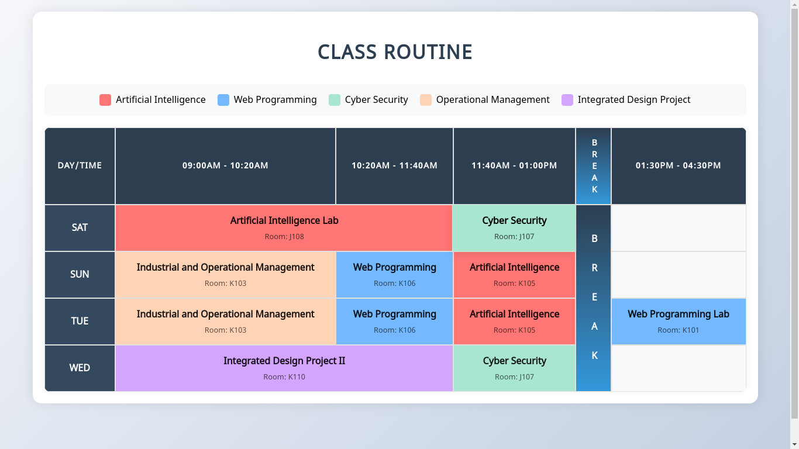

# Interactive Class Routine

This is a responsive and interactive class routine webpage created using **HTML** and **CSS**. The project showcases a visually appealing class schedule with color-coded subjects and a responsive layout suitable for all devices.

## Features
- Responsive design for various screen sizes
- Color-coded legend for easy identification of subjects
- Interactive hover effects for a better user experience
- Clean and modern UI layout

## Technologies Used
- **HTML**: For the structure of the webpage
- **CSS**: For styling and responsive design

## File Structure
# Interactive Class Routine

This is a responsive and interactive class routine webpage created using **HTML** and **CSS**. The project showcases a visually appealing class schedule with color-coded subjects and a responsive layout suitable for all devices.

## Features
- Responsive design for various screen sizes
- Color-coded legend for easy identification of subjects
- Interactive hover effects for a better user experience
- Clean and modern UI layout

## Technologies Used
- **HTML**: For the structure of the webpage
- **CSS**: For styling and responsive design

## File Structure
# Interactive Class Routine

This is a responsive and interactive class routine webpage created using **HTML** and **CSS**. The project showcases a visually appealing class schedule with color-coded subjects and a responsive layout suitable for all devices.

## Features
- Responsive design for various screen sizes
- Color-coded legend for easy identification of subjects
- Interactive hover effects for a better user experience
- Clean and modern UI layout

## Technologies Used
- **HTML**: For the structure of the webpage
- **CSS**: For styling and responsive design

## File Structure
  ├── index.html # Main HTML file for the class routine <br>
  └── styles.css # CSS file for styling the webpage


## Getting Started
1. Clone the repository:
    ```sh
    git clone https://github.com/asifikbal09/class-routine-with-HTML-and-CSS.git
    ```
2. Navigate to the project folder:
    ```sh
    cd class-routine-with-HTML-and-CSS
    ```
3. Open `index.html` in your preferred browser.

## Live Demo
Check out the live demo of the Interactive Class Routine [here](https://zesty-dasik-4acea4.netlify.app/).

## Screenshots


## How to Use
- Simply open the `index.html` file in any modern browser.
- Hover over the routine cells for interactive effects.
- The routine is color-coded for easy identification of subjects.

## Contributing
Feel free to fork the repository and submit pull requests for improvements or new features.


## Author
- [Your Name](https://github.com/asifikbal09)

